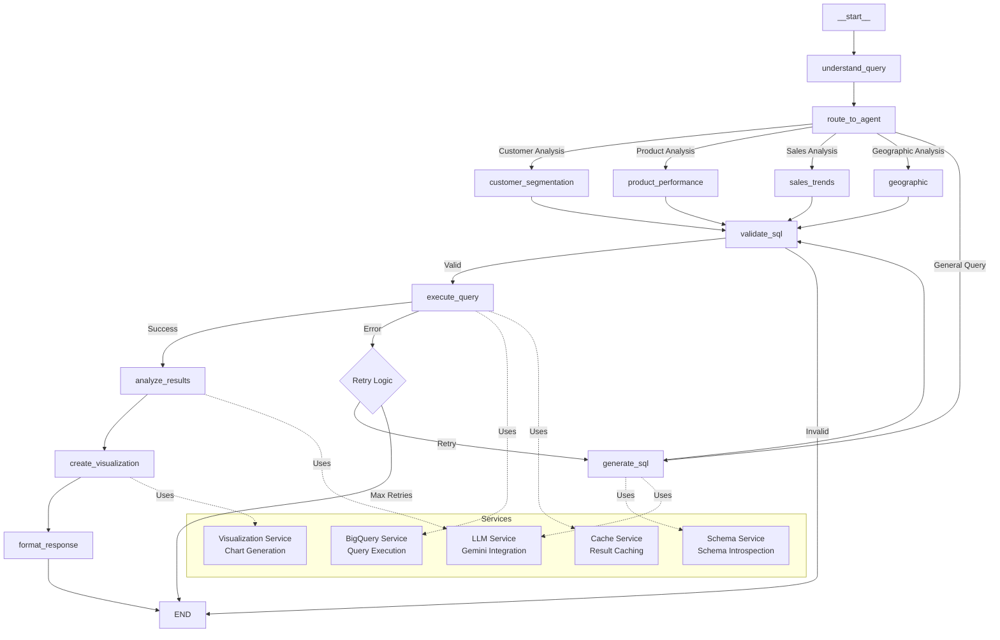

# E-commerce Analytics Agent

An AI-powered analytics agent that transforms natural language queries into SQL, executes them on BigQuery, and generates actionable business insights with visualizations. Built with LangGraph and LangChain, designed for analyzing the `bigquery-public-data.thelook_ecommerce` dataset.

## Features

- **Natural Language to SQL**: Converts business questions into optimized BigQuery SQL queries using Google Gemini
- **Multi-Agent Architecture**: Specialized agents for different analysis types (customer segmentation, product performance, sales trends, geographic analysis)
- **Intelligent Query Routing**: LLM-powered routing to direct queries to appropriate specialized agents
- **Automatic Error Recovery**: Pattern-based and LLM-driven SQL error correction with retry logic
- **Schema-Aware SQL Generation**: Dynamic schema introspection with column-to-table mapping for accurate query generation
- **BigQuery-Specific Optimization**: Handles BigQuery-specific functions (`DATE_DIFF`, `DATE_ADD`, `DATE_TRUNC`, etc.) correctly
- **Business Insights Generation**: Context-aware insight generation based on query type and results
- **Automatic Visualization**: Smart chart type detection and Vega-Lite visualization generation
- **Query Result Caching**: In-memory caching for frequently executed queries
- **Comprehensive Logging**: Structured JSON logging with request tracing and correlation IDs
- **Production Ready**: Error handling, retry logic, input validation, and comprehensive test coverage

---

## Architecture Overview

The agent is built using **LangGraph** for workflow orchestration and **LangChain** for LLM integration. The architecture follows a state-based graph design with conditional routing, specialized agents, and multiple fallback mechanisms.

### Graph Design

The workflow consists of multiple nodes connected through conditional and sequential edges, supporting both a general workflow and specialized agent paths:

**Core Nodes:**
1. **understand_query**: Classifies query intent and determines routing
2. **route_to_agent**: Routes queries to specialized agents or general workflow
3. **generate_sql**: Generates SQL queries using LLM with schema context
4. **validate_sql**: Validates SQL syntax and safety (prevents destructive queries)
5. **execute_query**: Executes queries on BigQuery with error recovery and retry logic
6. **analyze_results**: Generates business insights from query results
7. **create_visualization**: Creates Vega-Lite chart specifications
8. **format_response**: Structures final response for output

**Specialized Agents:**
- **customer_segmentation_agent**: Customer segmentation and behavior analysis
- **product_performance_agent**: Product performance and catalog analysis
- **sales_trends_agent**: Sales trends and forecasting
- **geographic_analysis_agent**: Geographic sales patterns

### Graph Structure



### Graph Flow

**Specialized Agent Path:**
```
understand_query → route_to_agent → [specialized_agent] → validate_sql → execute_query → analyze_results → create_visualization → format_response → END
```

**General Workflow Path:**
```
understand_query → route_to_agent → generate_sql → validate_sql → execute_query → analyze_results → create_visualization → format_response → END
```

**Error Recovery Flow:**
```
execute_query → [Error] → _fix_sql_error → [Retry] → execute_query → [Success/Retry Limit]
```

### State Management

The graph uses an `AgentState` TypedDict that flows through all nodes:

**State Schema:**
```python
class AgentState(TypedDict):
    messages: List[BaseMessage]          # Conversation history
    query: str                            # User's natural language query
    sql_query: Optional[str]              # Generated SQL query
    query_result: Optional[pd.DataFrame] # Query execution results
    insights: Optional[str]               # Business insights generated
    visualization_spec: Optional[Dict]   # Vega-Lite chart specification
    error: Optional[str]                  # Error message if any step fails
    query_metadata: Optional[Dict]        # Query type, complexity, etc.
    retry_count: Optional[int]            # Retry attempt counter
    previous_errors: Optional[List[str]]  # Previous error messages for recovery
```

State is replaced (not accumulated) at each node to ensure clean data flow. Each node receives the current state, processes it, and returns an updated state.

### Node Structure

Each node is a pure function that:
- Takes `AgentState` as input
- Returns updated `AgentState`
- Logs execution with structured logging
- Handles errors gracefully
- Uses service instances for external operations

Nodes are connected via:
- **Sequential edges**: Direct flow (e.g., `generate_sql` → `validate_sql`)
- **Conditional edges**: Branch based on state (e.g., router decision, validation result)

---

## Agents

The agent system consists of a router and multiple specialized agents, each optimized for specific analysis types.

### Router Agent (`route_to_agent`)

The router analyzes the query and routes it to the appropriate specialized agent or the general workflow:

- **Customer Segmentation**: Routes queries about customers, users, segmentation, CLV, retention
- **Product Performance**: Routes queries about products, inventory, categories, performance
- **Sales Trends**: Routes queries about sales, revenue, trends, forecasting
- **Geographic Analysis**: Routes queries about countries, regions, shipping, geographic patterns
- **General**: Falls back to general workflow for other queries

### Specialized Agents

#### Customer Segmentation Agent (`customer_segmentation_agent`)

**Purpose**: Analyze customer behavior, segmentation, lifetime value, and retention patterns.

**Capabilities**:
- Customer segmentation by order value, purchase frequency, recency
- Customer Lifetime Value (CLV) calculation and tier segmentation
- Retention rate analysis and churn pattern identification
- Customer behavior analysis across demographics

**Example Queries**:
- "Segment customers by their total order value"
- "Calculate customer lifetime value and segment customers by CLV tiers"
- "Analyze customer retention rates and identify churn patterns"

#### Product Performance Agent (`product_performance_agent`)

**Purpose**: Analyze product performance, inventory, pricing, and catalog metrics.

**Capabilities**:
- Product revenue and profit margin analysis
- Inventory turnover rate calculation
- Product category performance comparison
- Pricing analysis and markup calculations

**Example Queries**:
- "Show me top 10 products by revenue"
- "Calculate inventory turnover rates by product category"
- "Compare profit margins across different product brands"

#### Sales Trends Agent (`sales_trends_agent`)

**Purpose**: Analyze sales trends, revenue forecasting, and temporal patterns.

**Capabilities**:
- Sales trend analysis over time periods
- Revenue forecasting based on historical data
- Month-over-month and year-over-year growth calculations
- Seasonal pattern identification

**Example Queries**:
- "Show me sales trends over the last 12 months"
- "Generate revenue forecast for the next 3 months based on historical trends"
- "Calculate month-over-month growth rates for sales"

#### Geographic Analysis Agent (`geographic_analysis_agent`)

**Purpose**: Analyze geographic sales patterns, shipping performance, and regional metrics.

**Capabilities**:
- Sales performance by country/region
- Shipping time and delivery performance analysis
- Geographic distribution of customers and orders
- Regional revenue and profit comparisons

**Example Queries**:
- "Show me sales by country or region"
- "Compare sales performance across different countries"
- "Analyze shipping times and delivery performance by country"

---

## Prompts

The system uses sophisticated prompt engineering with dynamic assembly, few-shot examples, and context-aware generation.

### SQL Generation Prompts (`prompts/sql_generation.py`)

**Base Prompt Structure**:
- Schema context with table definitions and relationships
- BigQuery-specific function guidance (`DATE_DIFF`, `DATE_ADD`, `DATE_TRUNC`, etc.)
- Safety rules (SELECT-only queries, fully qualified table names)
- Few-shot examples based on query type

**Dynamic Prompt Assembly**:
- Incorporates query metadata (type, complexity)
- Includes previous errors for error recovery
- Adds query-specific few-shot examples
- Provides column-to-table mapping for schema awareness

**Few-Shot Examples by Type**:
- **Count queries**: Simple aggregation examples
- **Ranking queries**: TOP N and ordering examples
- **Aggregation queries**: GROUP BY and aggregation function examples
- **Temporal queries**: Date/time function examples
- **Geographic queries**: Location-based filtering examples
- **Customer analysis**: User segmentation examples
- **Product analysis**: Product performance examples

### Business Insights Prompts (`prompts/business_insights.py`)

**Template-Based Generation**:
- Different templates for different query types (count, ranking, aggregation, temporal, etc.)
- Context-aware questions based on query type
- Structured output formats (bullet points, numbered lists, paragraphs, timelines)

**Insight Types**:
- **Count insights**: Focus on scale and magnitude
- **Ranking insights**: Focus on top performers and patterns
- **Aggregation insights**: Focus on averages and aggregates in business context
- **Temporal insights**: Focus on trends over time
- **Customer insights**: Focus on customer behavior and segmentation
- **Product insights**: Focus on product performance patterns
- **Sales insights**: Focus on revenue patterns and sales strategy

**Comprehensive Insight Generation**:
- Business context interpretation
- Actionable recommendations
- Trend identification
- Comparative analysis

---

## Services Implemented

### BigQuery Service (`services/bigquery_service.py`)

**Purpose**: Execute SQL queries on BigQuery and provide schema introspection.

**Features**:
- BigQuery client initialization with automatic project ID detection
- Query execution with error handling and timeout management
- Result streaming and pagination support
- Query result caching integration
- Query optimization (cost estimation, complexity analysis)
- Comprehensive logging with execution metrics

**Key Methods**:
- `execute_query()`: Execute SQL queries with caching and optimization
- `get_table_schema()`: Introspect table schemas
- `_get_project_id()`: Auto-detect project ID from gcloud config

### Schema Service (`services/schema_service.py`)

**Purpose**: Build schema context for SQL generation and manage table relationships.

**Features**:
- Dynamic schema fetching from BigQuery
- Schema caching for performance
- Table relationship mapping
- Column-to-table location mapping
- Schema context building for prompts

**Key Methods**:
- `get_table_schema()`: Fetch table schema with caching
- `build_schema_context()`: Build formatted schema context string
- `build_column_location_map()`: Map columns to their tables
- `get_all_schemas()`: Fetch all required table schemas

### LLM Service (`services/llm_service.py`)

**Purpose**: Interface with Google Gemini for SQL generation and insight analysis.

**Features**:
- Google Gemini integration via LangChain
- Text generation for SQL queries
- SQL-specific generation with prompt templates
- Token usage tracking and logging
- Execution time monitoring
- Error handling and retry logic

**Key Methods**:
- `generate_text()`: Generate text from prompts
- `generate_sql()`: Generate SQL queries with schema context
- `_hash_prompt()`: Sanitize prompts for logging

### Visualization Service (`services/visualization_service.py`)

**Purpose**: Generate Vega-Lite chart specifications from query results.

**Features**:
- Automatic chart type detection (bar, line, pie, scatter, table)
- Query type-aware visualization selection
- Vega-Lite specification generation
- Altair chart creation
- Default sizing and styling

**Key Methods**:
- `detect_chart_type()`: Auto-detect appropriate chart type
- `create_bar_chart()`: Generate bar chart specifications
- `create_line_chart()`: Generate line chart specifications
- `create_scatter_chart()`: Generate scatter chart specifications
- `create_visualization()`: Main method to create visualizations

### Cache Service (`services/cache_service.py`)

**Purpose**: Cache query results and schema information for performance.

**Features**:
- In-memory query result caching
- TTL-based expiration (default: 1 hour)
- Cache key generation from query hash
- Cache statistics and cleanup
- Automatic expiration handling

**Key Methods**:
- `get_cached_result()`: Retrieve cached query results
- `cache_result()`: Cache query results with TTL
- `get_cache_stats()`: Get cache statistics
- `cleanup_expired()`: Remove expired cache entries

---

## Testing Strategy

The project follows a comprehensive testing strategy with multiple test layers:

### Test Structure

**Test Directories**:
- `test/`: Legacy sanity checks and basic tests
- `tests/unit/`: Unit tests for individual components
- `tests/integration/`: Integration tests for service interactions
- `tests/functional/`: Functional requirement validation tests
- `tests/e2e/`: End-to-end tests (if applicable)

### Test Categories

#### Unit Tests (`tests/unit/`)

**Coverage**:
- **Service Tests**: All services have comprehensive unit tests
  - `test_bigquery_service.py`: BigQuery service functionality
  - `test_schema_service.py`: Schema service operations
  - `test_llm_service.py`: LLM service integration
  - `test_cache_service.py`: Cache service operations
  - `test_visualization_service.py`: Visualization generation

- **Agent Tests**: Agent node and workflow tests
  - `test_agent_nodes_edge_cases.py`: Edge case handling
  - `test_specialized_agents.py`: Specialized agent functionality

- **Utility Tests**: Utility function tests
  - `test_logger.py`: Logging functionality
  - `test_tracing.py`: Request tracing
  - `test_request_context.py`: Context management
  - `test_query_optimizer.py`: Query optimization

- **Logging Tests**: Logging integration tests
  - `test_llm_service_logging.py`: LLM service logging
  - `test_schema_service_logging.py`: Schema service logging
  - `test_cache_service_logging.py`: Cache service logging
  - `test_visualization_service_logging.py`: Visualization service logging

**Test Count**: 292+ unit tests

#### Integration Tests (`tests/integration/`)

**Coverage**:
- `test_phase3_integration.py`: Phase 3 feature integration tests
- Service interaction tests
- End-to-end workflow validation

**Test Count**: 5+ integration tests

#### Functional Tests (`tests/functional/`)

**Coverage**:
- `test_functional_requirements.py`: Validates all functional requirements
- Tests 30+ functional queries covering:
  - Customer segmentation and behavior analysis
  - Product performance and recommendations
  - Sales trends and seasonality
  - Geographic patterns
  - Database structure queries
  - Order lifecycle analysis
  - Product catalog analysis
  - Customer demographics
  - Inventory analysis
  - Cross-table advanced analytics

**Test Count**: 30+ functional test queries

#### Sanity Checks (`test/`)

**Coverage**:
- `test_phase3_sanity.py`: Basic sanity checks for core functionality
- Quick validation of critical paths

**Test Count**: 5 sanity checks

### Running Tests

```bash
# Run all tests
pytest

# Run specific test categories
pytest -m unit              # Unit tests only
pytest -m integration       # Integration tests only
pytest -m functional        # Functional tests only

# Run with coverage
pytest --cov=. --cov-report=html

# Run specific test file
pytest tests/unit/test_bigquery_service.py

# Run with verbose output
pytest -v
```

### Test Coverage

- **Current Coverage**: 81%+ (target: 80%+ ✅ ACHIEVED)
- **Total Tests**: 302+ tests (5 sanity + 292 unit + 5 integration)
- **All Tests Passing**: ✅

---

## Setup Instructions

### Prerequisites

- Python 3.10 or higher
- Google Cloud account with BigQuery access
- Google API key for Gemini
- Virtual environment support

### Step 1: Clone Repository

```bash
git clone <repository-url>
cd thelook
```

### Step 2: Create Virtual Environment

```bash
# Windows
python -m venv .venv
.venv\Scripts\activate

# Linux/Mac
python3 -m venv .venv
source .venv/bin/activate
```

### Step 3: Install Dependencies

```bash
pip install -r requirements.txt
```

### Step 4: Get API Keys

#### Google API Key (Gemini)

1. Visit [Google AI Studio](https://makersuite.google.com/app/apikey)
2. Sign in with your Google account
3. Click "Create API Key"
4. Copy the API key

#### Google Cloud Project Setup (for BigQuery)

1. **Install Google Cloud SDK**:
   ```bash
   # Windows: Download from https://cloud.google.com/sdk/docs/install
   # Linux/Mac:
   curl https://sdk.cloud.google.com | bash
   exec -l $SHELL
   ```

2. **Initialize gcloud CLI**:
   ```bash
   gcloud init
   ```
   - Select or create a Google Cloud project
   - Choose a default compute region
   - Enable BigQuery API if prompted

3. **Authenticate**:
   ```bash
   gcloud auth application-default login
   ```

4. **Set Project ID** (optional, can be auto-detected):
   ```bash
   gcloud config set project YOUR_PROJECT_ID
   ```

### Step 5: Access BigQuery Public Dataset

The agent uses the `bigquery-public-data.thelook_ecommerce` dataset, which is publicly accessible. No special permissions are required, but you need:

1. **BigQuery API Enabled**: Ensure BigQuery API is enabled in your Google Cloud project
   ```bash
   gcloud services enable bigquery.googleapis.com
   ```

2. **Verify Access**: Test access to the public dataset
   ```bash
   bq query --use_legacy_sql=false "SELECT COUNT(*) FROM \`bigquery-public-data.thelook_ecommerce.orders\` LIMIT 1"
   ```

### Step 6: Configure Environment Variables

Create a `.env` file in the project root:

```bash
# Google API Key (required)
GOOGLE_API_KEY=your_gemini_api_key_here

# Optional: Google Cloud Project ID (auto-detected if not set)
GOOGLE_CLOUD_PROJECT=your_project_id

# Optional: LLM Configuration
LLM_MODEL=gemini-2.5-flash
LLM_TEMPERATURE=0.1

# Optional: Logging Configuration
LOG_LEVEL=INFO
LOG_FORMAT=json
LOG_FILE=logs/app.log
```

### Step 7: Verify Setup

```bash
# Test API key validation
python -c "import config; print('Setup successful!')"

# Run a simple test
python cli.py "Count orders"
```

---

## Run the Application

### Command-Line Interface

The application provides a CLI for interactive and batch query execution.

#### Single Query

```bash
python cli.py "Show me top 10 products by revenue"
```

#### Interactive Mode

```bash
python cli.py
# Then type queries interactively
# Type 'exit' or 'quit' to exit
```

#### Batch Queries from File

```bash
python cli.py --file functional_test_queries.txt
```

#### Verbose Output

```bash
python cli.py --verbose "Segment customers by their total order value"
```

#### Save Results to JSON

```bash
python cli.py --output results.json "Show me sales trends over the last 12 months"
```

### Example Queries

#### Customer Segmentation

```bash
# Segment customers by order value
python cli.py "Segment customers by their total order value"

# Customer lifetime value analysis
python cli.py "Calculate customer lifetime value and segment customers by CLV tiers"

# Retention analysis
python cli.py "Analyze customer retention rates and identify churn patterns"
```

#### Product Performance

```bash
# Top products by revenue
python cli.py "Show me top 10 products by revenue"

# Inventory turnover
python cli.py "Calculate inventory turnover rates by product category"

# Profit margin comparison
python cli.py "Compare revenue and profit margins across product categories"
```

#### Sales Trends

```bash
# Sales trends over time
python cli.py "Show me sales trends over the last 12 months"

# Revenue forecasting
python cli.py "Generate revenue forecast for the next 3 months based on historical trends"

# Growth rates
python cli.py "Calculate month-over-month growth rates for sales"
```

#### Geographic Analysis

```bash
# Sales by country
python cli.py "Show me sales by country or region"

# Country comparison
python cli.py "Compare sales performance across different countries"

# Shipping performance
python cli.py "Analyze shipping times and delivery performance by country"
```

#### Advanced Analytics

```bash
# Customer acquisition cost
python cli.py "Calculate customer acquisition cost by traffic source and their lifetime value"

# Product bundling
python cli.py "Analyze product bundling opportunities based on frequently ordered together items"

# High-value segments
python cli.py "Identify high-value customer segments and their preferred product categories"
```

### Example Output

```bash
$ python cli.py "Show me top 10 products by revenue"

================================================================================
Query: Show me top 10 products by revenue
================================================================================

SQL Query:
SELECT 
  p.name,
  SUM(oi.sale_price * oi.num_of_item) as total_revenue
FROM `bigquery-public-data.thelook_ecommerce.order_items` oi
JOIN `bigquery-public-data.thelook_ecommerce.products` p ON oi.product_id = p.id
GROUP BY p.name
ORDER BY total_revenue DESC
LIMIT 10

Results:
                    name  total_revenue
0         Product Name 1     125000.50
1         Product Name 2     118000.25
...

Insights:
Based on the analysis of top 10 products by revenue:

• Product Name 1 leads with $125,000 in total revenue, indicating strong market demand
• The top 10 products account for approximately 15% of total revenue
• Revenue distribution shows healthy diversification across product categories
• Consider promoting top performers to maximize revenue potential

Visualization: Bar chart generated
```

---

## Version Specifications

### Python Version

- **Minimum**: Python 3.10
- **Recommended**: Python 3.11 or 3.12
- **Tested On**: Python 3.12.3

### Core Dependencies

```
google-cloud-bigquery>=3.0.0
db-dtypes>=1.0.0
langgraph>=0.2.0
langchain>=0.3.0
langchain-google-genai>=2.0.0
pandas>=2.0.0
altair>=5.0.0
python-dotenv>=1.0.0
```

### Logging Dependencies

```
structlog>=23.2.0
python-json-logger>=2.0.7
```

### Testing Dependencies

```
pytest>=7.4.0
pytest-cov>=4.1.0
pytest-mock>=3.11.1
pytest-asyncio>=0.21.0
```

### LLM Model

- **Default**: `gemini-2.5-flash`
- **Fallback Models**: `gemini-1.5-flash`, `gemini-1.5-pro`, `gemini-pro`
- **Temperature**: 0.1 (low temperature for SQL generation)

### BigQuery Dataset

- **Dataset**: `bigquery-public-data.thelook_ecommerce`
- **Tables**: `orders`, `order_items`, `products`, `users`
- **Access**: Public dataset, no special permissions required

---

## External Services Documentation

### Google BigQuery

#### Accessing `bigquery-public-data.thelook_ecommerce`

The `thelook_ecommerce` dataset is a public BigQuery dataset provided by Google. It contains e-commerce transaction data including orders, products, users, and order items.

**Dataset Location**: `bigquery-public-data.thelook_ecommerce`

**Tables**:
- `orders`: Order information with status, timestamps, shipping details
- `order_items`: Individual items within orders with pricing
- `products`: Product catalog with categories, brands, pricing
- `users`: User information with demographics and geography

#### Setting Up BigQuery Access

1. **Install Google Cloud SDK**:
   ```bash
   # Download from: https://cloud.google.com/sdk/docs/install
   # Or use package manager:
   # macOS: brew install google-cloud-sdk
   # Linux: Follow instructions at https://cloud.google.com/sdk/docs/install
   ```

2. **Initialize gcloud CLI**:
   ```bash
   gcloud init
   ```
   - Select or create a Google Cloud project
   - Choose a default region
   - Enable BigQuery API when prompted

3. **Authenticate**:
   ```bash
   # Application Default Credentials (recommended)
   gcloud auth application-default login
   
   # Or service account (for production)
   gcloud auth activate-service-account --key-file=path/to/service-account-key.json
   ```

4. **Set Project** (optional):
   ```bash
   gcloud config set project YOUR_PROJECT_ID
   export GOOGLE_CLOUD_PROJECT=YOUR_PROJECT_ID
   ```

5. **Enable BigQuery API**:
   ```bash
   gcloud services enable bigquery.googleapis.com
   ```

6. **Verify Access**:
   ```bash
   # Test query
   bq query --use_legacy_sql=false \
     "SELECT COUNT(*) as order_count \
      FROM \`bigquery-public-data.thelook_ecommerce.orders\` \
      LIMIT 1"
   ```

#### BigQuery Authentication Methods

**Method 1: Application Default Credentials (Recommended for Development)**
```bash
gcloud auth application-default login
```
This method is automatically used by the BigQuery client library.

**Method 2: Service Account (Recommended for Production)**
```bash
# Create service account
gcloud iam service-accounts create bigquery-service-account

# Grant BigQuery User role
gcloud projects add-iam-policy-binding YOUR_PROJECT_ID \
  --member="serviceAccount:bigquery-service-account@YOUR_PROJECT_ID.iam.gserviceaccount.com" \
  --role="roles/bigquery.user"

# Create and download key
gcloud iam service-accounts keys create key.json \
  --iam-account=bigquery-service-account@YOUR_PROJECT_ID.iam.gserviceaccount.com

# Set environment variable
export GOOGLE_APPLICATION_CREDENTIALS=path/to/key.json
```

**Method 3: Environment Variable**
```bash
export GOOGLE_CLOUD_PROJECT=your_project_id
```

### Google Gemini API

#### Getting API Key

1. Visit [Google AI Studio](https://makersuite.google.com/app/apikey)
2. Sign in with your Google account
3. Click "Create API Key"
4. Copy the API key
5. Add to `.env` file: `GOOGLE_API_KEY=your_key_here`

#### API Limits

- **Rate Limits**: Vary by model and tier
- **Quota**: Check your Google Cloud Console for current quotas
- **Cost**: Pay-per-use pricing, check [Google AI Pricing](https://ai.google.dev/pricing)


---

## Portability Requirements

The solution is designed to run on any machine with proper setup:

### Requirements

- **Python**: 3.10+ installed
- **Virtual Environment**: Support for Python virtual environments
- **Internet Access**: Required for LLM API calls and BigQuery access
- **Google Cloud Account**: For BigQuery access (free tier available)
- **Google API Key**: For Gemini API (free tier available)

### Setup Process

1. **Clone Repository**
   ```bash
   git clone https://github.com/Kochurovskyi/thelook
   cd thelook
   ```

2. **Create Virtual Environment**
   ```bash
   python -m venv .venv
   source .venv/bin/activate  # Linux/Mac
   .venv\Scripts\activate     # Windows
   ```

3. **Install Dependencies**
   ```bash
   pip install -r requirements.txt
   ```

4. **Configure Environment**
   - Create `.env` file with API keys
   - Set up Google Cloud authentication
   - Verify BigQuery access

5. **Run Application**
   ```bash
   python cli.py "Your query here"
   ```

### Dependency Management

- All dependencies specified in `requirements.txt`
- Version constraints ensure compatibility
- No system-level dependencies beyond Python
- Cross-platform support (Windows, Linux, macOS)

### Environment Configuration

- All configuration via `.env` file (not committed to git)
- Environment variables override defaults
- Clear documentation for all required variables
- Validation on startup ensures proper configuration

### Platform Support

- **Windows**: Tested on Windows 10/11
- **Linux**: Compatible with major distributions
- **macOS**: Compatible with recent versions

---

## Example Questions

The agent can handle various types of questions about the e-commerce dataset:

### Customer Segmentation and Behavior

- "Segment customers by their total order value"
- "Calculate customer lifetime value and segment customers by CLV tiers"
- "Analyze customer retention rates and identify churn patterns"
- "Segment customers by age groups and analyze their purchasing patterns"
- "Compare sales performance by traffic source (where customers came from)"
- "Analyze gender-based purchasing preferences across product categories"

### Product Performance

- "Show me top 10 products by revenue"
- "Calculate inventory turnover rates by product category"
- "Compare revenue and profit margins across product categories"
- "Compare profit margins across different product brands and departments"
- "Analyze price distribution and identify products with unusual pricing patterns"
- "Find products with highest markup percentage (retail_price vs cost)"

### Sales Trends

- "Show me sales trends over the last 12 months"
- "Generate revenue forecast for the next 3 months based on historical trends"
- "Calculate month-over-month growth rates for sales"

### Geographic Patterns

- "Show me sales by country or region"
- "Compare sales performance across different countries"
- "Analyze shipping times and delivery performance by country"

### Order Lifecycle

- "Calculate average time from order creation to delivery by order status"
- "Analyze return rates and return processing times by product category"
- "Identify orders with delayed shipping and their impact on customer satisfaction"

### Inventory and Distribution

- "Calculate inventory turnover by distribution center"
- "Identify products with high return rates at specific distribution centers"
- "Analyze shipping performance differences across distribution centers"

### Advanced Analytics

- "Calculate customer acquisition cost by traffic source and their lifetime value"
- "Analyze product bundling opportunities based on frequently ordered together items"
- "Identify high-value customer segments and their preferred product categories"

### Database Structure

- "What tables are in the database and what are their columns?"
- "What are the relationships between the orders and order_items tables?"
- "Check for missing values and data quality issues in the orders table"

---

## Project Structure

```
thelook/
├── README.md                    # This file
├── requirements.txt              # Python dependencies
├── pytest.ini                   # Pytest configuration
├── .gitignore                   # Git ignore rules
├── config.py                     # Configuration and validation
├── cli.py                        # Command-line interface
│
├── agents/                       # LangGraph agent workflow
│   ├── __init__.py
│   ├── graph.py                 # Graph definition and compilation
│   ├── nodes.py                 # Core agent nodes
│   ├── state.py                 # AgentState TypedDict
│   └── specialized_agents.py    # Specialized agent implementations
│
├── services/                     # Core services
│   ├── __init__.py
│   ├── bigquery_service.py      # BigQuery query execution
│   ├── schema_service.py        # Schema introspection
│   ├── llm_service.py           # Gemini LLM integration
│   ├── cache_service.py         # Query result caching
│   └── visualization_service.py # Chart generation
│
├── prompts/                      # Prompt templates
│   ├── __init__.py
│   ├── sql_generation.py        # SQL generation prompts
│   ├── business_insights.py     # Insight generation templates
│   └── insight_generation.py    # Insight prompt utilities
│
├── utils/                        # Utility modules
│   ├── __init__.py
│   ├── logger.py                # Logging setup
│   ├── logging_config.py        # Logging configuration
│   ├── tracing.py                # Request tracing
│   ├── request_context.py        # Context management
│   ├── query_optimizer.py       # Query optimization
│   └── formatters.py            # Output formatting
│
├── tests/                        # Test suite
│   ├── __init__.py
│   ├── conftest.py              # Pytest configuration
│   ├── unit/                    # Unit tests
│   │   ├── test_bigquery_service.py
│   │   ├── test_schema_service.py
│   │   ├── test_llm_service.py
│   │   ├── test_cache_service.py
│   │   ├── test_visualization_service.py
│   │   ├── test_agent_nodes_edge_cases.py
│   │   ├── test_specialized_agents.py
│   │   └── ... (logging tests)
│   ├── integration/             # Integration tests
│   │   └── test_phase3_integration.py
│   ├── functional/              # Functional tests
│   │   └── test_functional_requirements.py
│   └── e2e/                     # End-to-end tests
│
├── test/                         # Legacy tests
│   ├── test_phase3_sanity.py
│   └── ... (legacy test files)
│
├── logs/                         # Application logs
│   └── app.log
│
├── other/                        # Documentation and metadata
│   ├── mds/                     # Markdown documentation
│   │   ├── e-commerce_analytics.md
│   │   ├── functional_requirements.md
│   │   ├── module_analysis.md
│   │   └── ...
│   └── arch/                    # Architecture diagrams
│
└── functional_test_queries.txt   # Example queries for testing
```


